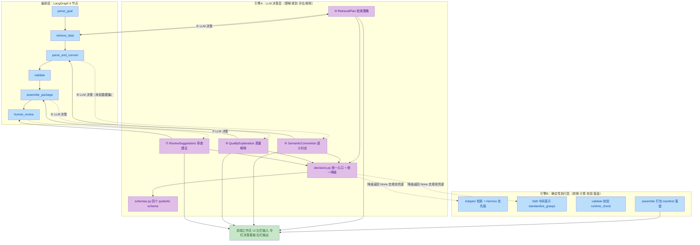
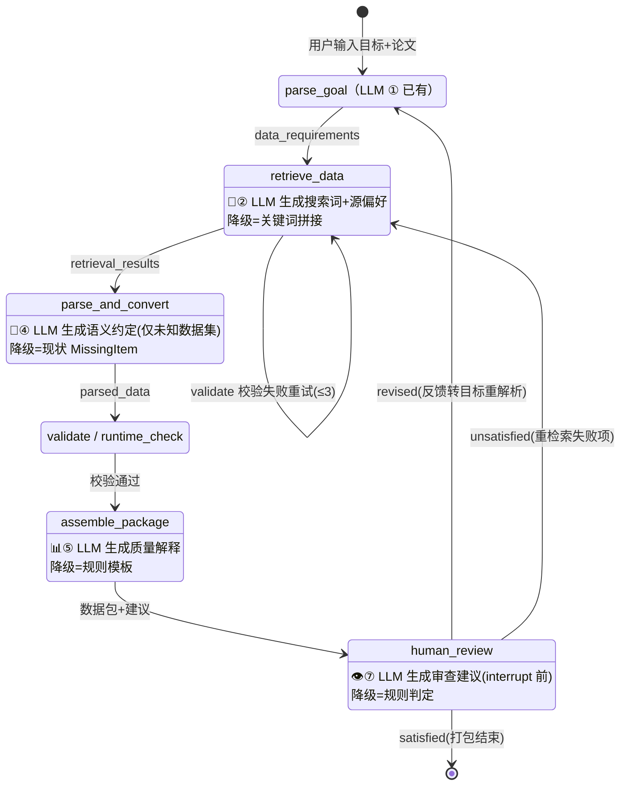
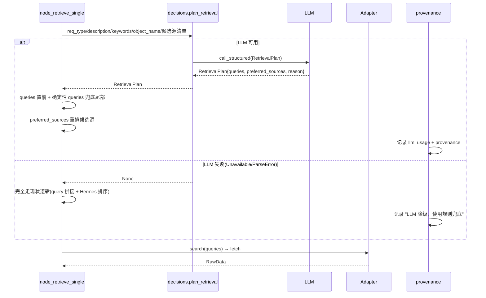
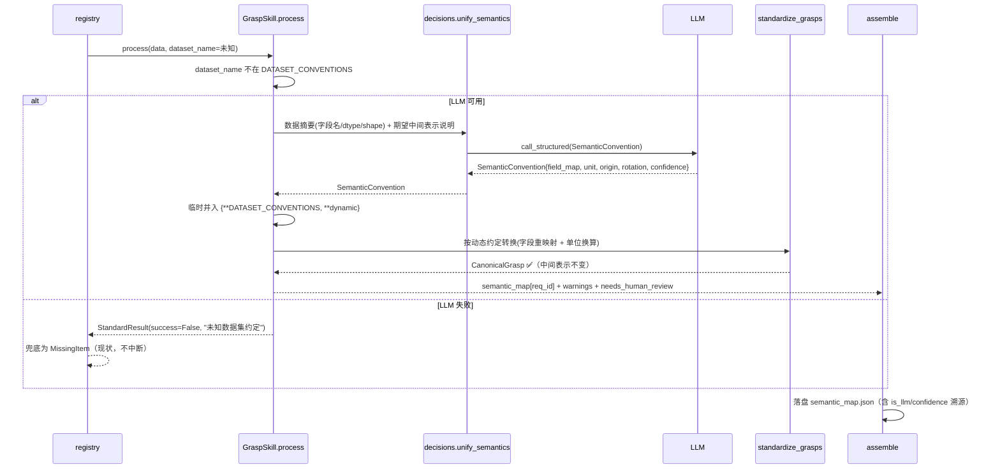
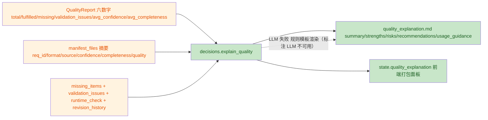
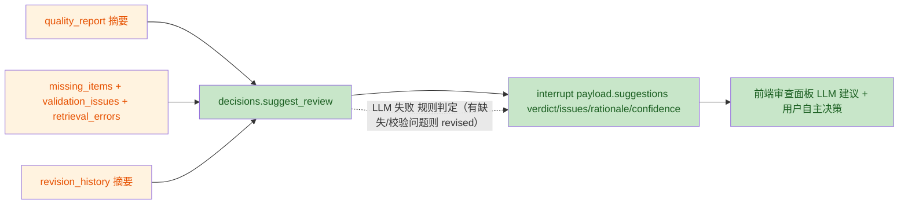

# RDI LLM 智能决策层 · 详细设计方案

> 配套文档：[spec.md](./spec.md)（需求规格）· [checklist.md](./checklist.md)（验收清单）· [tasks.md](./tasks.md)（执行任务）
> 本文档回答三个问题：**新的架构是什么 / 运行时如何流转 / 为什么这样设计**。

---

## 1. 📋 高层摘要 (TL;DR)

*   **影响 (Impact):** 🔴 **高 (High)** — 系统从「确定性流水线」升级为「**LLM 决策层 + 确定性执行层**」双引擎架构，在既有 6 节点 LangGraph 流程中嵌入 **4 个 LLM 决策点**（②检索策略规划 / ④数据语义统一 / ⑤质量报告解释 / ⑦审查建议），前端同步改为工作区式三栏。新增 ~7 个文件（`intelligence/decisions.py`、`schemas.py`、4 个 prompts 文件、`semantic_map.json` 落盘），修改 8 个核心文件。
*   **关键变化 (Key Changes):**
    *   🧠 **② 检索策略规划**：LLM 生成搜索词组合 + 源偏好，替代当前"关键词机械拼接"。
    *   📐 **④ 数据语义统一**：LLM 在"原始格式 → Canonical 中间表示"环节动态补全约定（字段映射/单位/坐标系），复用既有 `standardize_grasps` 确定性换算。
    *   📊 **⑤ 质量报告解释**：LLM 把纯数字 `QualityReport` 翻译为 `quality_explanation.md`（summary/risks/recommendations/usage_guidance）。
    *   👁️ **⑦ 审查建议**：LLM 在用户审查中断前给出建议决策 + 逐项问题清单（进 interrupt payload）。
    *   🖥️ **前端工作区式改造**：4 Tab → 三栏工作区（参考 Trae Work / Kimi Work），中栏按阶段展示 LLM 决策面板。
*   **铁律 (用户明确要求):**
    > 🛡️ **LLM 决策错误直接用规则兜底**，绝不让运行中断，一定要返回有结果（复用 human_review `_convert_feedback_to_goal` 降级范式）。
    > 🔢 **数值计算永远留在代码层**，LLM 只做判断/决策/解释，保证可复现、可校验。

---

## 2. 🏗️ 架构设计

### 2.1 双引擎架构总览



**核心思想**：LLM 决策层与确定性执行层**并立而非替代**。LLM 只在四个"需要语义理解"的环节给出决策（JSON schema 约束），决策结果回喂给确定性执行层完成数值计算与落盘；LLM 失败时返回 `None`，执行层自动走规则兜底路径。

### 2.2 模块分层与文件布局

```
src/rdi/
├── intelligence/                    # 🆕 LLM 决策层（新增）
│   ├── decisions.py                 #   4 个决策函数 + 统一降级 + 懒加载单例
│   ├── schemas.py                   #   RetrievalPlan / SemanticConvention /
│   │                                #   QualityExplanation / ReviewSuggestions
│   └── prompts/
│       ├── retrieval_plan.py        #   ② 系统提示词
│       ├── semantic_unification.py  #   ④ 系统提示词
│       ├── quality_explanation.py   #   ⑤ 系统提示词
│       └── review_suggestions.py    #   ⑦ 系统提示词
├── graph/
│   ├── state.py                     # 🆕 +5 字段（retrieval_plan/semantic_map/
│   │                                #   quality_explanation/review_suggestions/llm_usage）
│   └── nodes/
│       ├── retrieve_data.py         # 🔧 ② 插入点（node_retrieve_single query 构造前）
│       ├── assemble.py              # 🔧 ⑤ 插入点（QualityReport 构建后）
│       └── human_review.py          # 🔧 ⑦ 插入点（interrupt 前）
├── skills/
│   ├── grasp_parse.py               # 🔧 ④ 插入点（process L210 未知数据集检查）
│   └── registry.py                  # 🔧 ④ 透传 semantic_map 到 state
└── frontend/app.py                  # 🔧 前端工作区式改造
```

### 2.3 四个决策点定位总表

| # | 决策点 | 决策内容（LLM 产出） | 插入位置 | 规则兜底（LLM 失败时） |
|---|--------|----------------------|----------|------------------------|
| ② | 检索策略规划 | `RetrievalPlan{queries, preferred_sources, reason, confidence}` | `retrieve_data.py` query 构造处 | 现状关键词拼接 + Hermes 源排序 |
| ④ | 数据语义统一 | `SemanticConvention{dataset_name, semantic_type, rotation, origin, unit, field_map, confidence, needs_human_review}` | `grasp_parse.py` 未知数据集检查处 | 未知数据集 → MissingItem（现状） |
| ⑤ | 质量报告解释 | `QualityExplanation{summary, strengths, risks, recommendations, usage_guidance, confidence}` | `assemble.py` QualityReport 后 | 规则模板渲染自然语言段落 |
| ⑦ | 审查建议 | `ReviewSuggestions{verdict, issues[], rationale, confidence}` | `human_review.py` interrupt 前 | 有缺失/校验问题→revised，否则 satisfied |

### 2.4 新增 state 字段（全部 msgpack 可序列化）

| 字段 | 类型 | 写入节点 | 消费方 |
|------|------|----------|--------|
| `retrieval_plan` | `dict[str, RetrievalPlan]` | retrieve_data | 前端检索面板 |
| `semantic_map` | `dict[str, SemanticConvention]` | grasp_parse/registry | 前端转换面板 + assemble 落盘 |
| `quality_explanation` | `QualityExplanation \| None` | assemble | 前端打包面板 + 落盘 md |
| `review_suggestions` | `ReviewSuggestions \| None` | human_review | 前端审查面板 |
| `llm_usage` | `list[dict]` | 四个决策点 | 前端 LLM 调用记录 + 报告 |

---

## 3. 🔄 运行逻辑视图

### 3.1 全流程运行视图（含决策点嵌入）



> 每个决策点都是**可选增强**：LLM 可用 → 决策生效并记录；LLM 不可用 → 节点按现状逻辑继续，provenance 记录"LLM 降级"。整条主链路（灰底节点）在任何情况下都能跑通。

### 3.2 ② 检索策略规划 · 时序图



### 3.3 ④ 数据语义统一 · 时序图（未知数据集动态约定）



### 3.4 ⑤ 质量报告解释 · 数据流



### 3.5 ⑦ 审查建议 · 数据流



### 3.6 统一降级机制（四决策点共享）

```python
# 伪代码：decisions.py 内每个决策函数的结构
def plan_retrieval(...) -> RetrievalPlan | None:
    try:
        result = _get_llm_client().call_structured(prompt, schema=RetrievalPlan, system=...)
        logger.info("llm_decision.retrieval_plan", model=..., status="ok", elapsed=...)
        return result
    except (LLMUnavailableError, LLMParseError) as e:
        logger.warning("llm_decision.retrieval_plan", status="fallback", reason=str(e))
        return None          # 调用方走规则兜底，绝不中断
```

> 该结构复刻 [human_review.py L89-97](file:///c:/Users/yzl13/Documents/GitHub/robot-data-integrator/src/rdi/graph/nodes/human_review.py#L89-L97) `_convert_feedback_to_goal` 的既有降级范式——系统内已验证过的模式，四决策点统一沿用。

---

## 4. 💡 设计解释

### 4.1 为什么是"双引擎"而非"全 LLM 化"？

| 维度 | LLM 决策层 | 确定性执行层 |
|------|-----------|--------------|
| 职责 | 理解语义、生成策略、评估风险、给出建议 | 检索、换算、校验、打包、落盘 |
| 输出 | 结构化 JSON 决策（有 confidence） | 可复现的数值/文件结果 |
| 失败时 | 返回 None → 规则兜底 | 永不因 LLM 而中断 |
| 审计 | `llm_usage` + provenance 全程记录 | checksums/units.json/manifest 可溯源 |

**理由**：竞赛评审会检查"可复现性"与"诚实性"。若数值计算也交给 LLM，同一输入两次运行可能得到不同结果，且无法证明正确性。让 LLM 只做"人类擅长而代码不擅长"的**语义判断**，让代码做"机器擅长而 LLM 不可靠"的**数值计算**，两者结合既凸显 AI 元素，又守住科研数据整合的底线。

### 4.2 为什么先做 ②④⑤⑦ 这四点？

用户限定了范围（时间有限，先做能"算得上 AI 应用"的部分）：

- **② 检索策略规划**：系统入口后的第一个 LLM 增强点，直接改善"搜得准不准"，用户可在检索阶段立即看到 LLM 决策（queries/源偏好）。
- **④ 数据语义统一**：用户的核心诉求——"不同格式数据的统一表达"。它贴合系统既有的**中间表示机制**：`standardize_grasps` 按 `DATASET_CONVENTIONS` 把各数据集统一为 `CanonicalGrasp`，但硬编码表只覆盖 4 个数据集。LLM 在此**动态补全约定**，让中间表示机制从"4 个已知源"扩展到"任意未知源"，机制本身零改动。
- **⑤ 质量报告解释**：从"一堆数字"到"看得懂的风险说明"，是交付物叙事能力的直接提升（`quality_explanation.md` 可原样进竞赛 PDF）。
- **⑦ 审查建议**：让人机交互从"用户盲选"变为"LLM 先给判断，用户再决策"，体现系统的主动智能。

**不做的（本阶段）**：③ 检索结果语义筛选（涉及结果打分排序，依赖 ② 完成后才有意义）、⑥ 论文深度解析（需多模态扩展，独立计划）。数值换算、校验逻辑等一切现有确定性能力全部不动。

### 4.3 ④ 为什么落在 skill 层而非节点层？

系统处理异构数据的链路是 `registry → skill.process → standardize_grasps → CanonicalGrasp → ParsedItem`。"先转中间表示再统一处理"发生在 **skill 层**（[grasp_parse.py](file:///c:/Users/yzl13/Documents/GitHub/robot-data-integrator/src/rdi/skills/grasp_parse.py)），因此语义统一的插入点必须在 skill 内部，而不是节点层事后贴标签：

- 正确的语义理解发生在**转换之前**（LLM 告诉代码"这个未知数据集怎么映射"），转换仍由确定性代码完成；
- 若在节点层事后标注，只能解释"已经转出来的东西"，无法让**未知数据集**进入中间表示体系——那正是当前 `DATASET_CONVENTIONS` 的缺口（[process L210](file:///c:/Users/yzl13/Documents/GitHub/robot-data-integrator/src/rdi/skills/grasp_parse.py#L207-L218) 直接 `success=False`）。
- 兜底语义自然：LLM 失败 = 现状（未知数据集 → MissingItem），零行为回归。

### 4.4 前端为什么改成工作区式？

现状 4 Tab（目标输入/进度展示/数据包审查/校验缺失）是"表单提交式"：用户输入 → 等结果 → 看静态报告，**看不到 AI 在过程中的判断**。竞赛要凸显 LLM，就必须把决策过程"可视化"。

参考 Trae Work / Kimi Work 的工作区范式，映射到 Gradio：

```
┌─────────────────────────────────────────────────────────────────┐
│ 顶部状态条: [run_id] [状态徽章: success|failed|demo] [阶段进度条] │
├──────────────────┬────────────────────────────────┬─────────────┤
│ 左栏·上下文与控制 │ 中栏·主工作区(决策看板,随阶段切换)│ 右栏·输出详情 │
│                  │                                │             │
│ 运行模式(默认真实) │ 检索阶段: RetrievalPlan 面板    │ provenance   │
│ 目标输入          │   queries/preferred_sources/   │ 数据包目录树  │
│ 论文 PDF         │   reason (+ LLM|fallback 标注)  │ manifest.json│
│ 本地文件注入      │ 转换阶段: SemanticConvention    │ semantic_map │
│ 审查决策/反馈     │   面板 + needs_human_review 标黄│ llm_usage    │
│ 运行 / 继续按钮   │ 校验阶段: validation_issues      │              │
│                  │ 打包阶段: quality_explanation 渲染│              │
│                  │ 审查阶段: ReviewSuggestions 面板 │              │
└──────────────────┴────────────────────────────────┴─────────────┘
```

**设计要点**：
1. **LLM/规则双标注**——每个决策面板都标注"LLM 生成"或"规则兜底"，诚实呈现 AI 参与度（评审能看到 AI 真实在工作）；
2. **默认"真实流程"**——演示模式保留为可选（环境保险丝），不再是默认；
3. **左进右出**——左侧输入控制、右侧溯源产物，符合"工作区"心智模型；
4. **llm_usage 记录**——右侧展示每次 LLM 调用的 decision/model/status/耗时，可量化 AI 使用情况。

### 4.5 成本与性能考量

- 每次运行新增 LLM 调用 ≈ **②按 req 数** + **④仅未知数据集触发（已知源零开销）** + **⑤×1** + **⑦×1**；
- ②④ 失败即降级为现状，**不增加失败风险**，只增加调用时长；
- 所有决策调用与节点主逻辑串行，未引入异步复杂度（与 `_convert_feedback_to_goal` 现状一致）。

---

## 5. ⚠️ 影响与风险评估

### 5.1 变更总表

| 类型 | 内容 | 说明 |
|------|------|------|
| 🆕 新增文件 | `intelligence/decisions.py`、`schemas.py`、4 个 prompts | LLM 决策层基座 |
| 🔧 修改 | `state.py`（+5 字段）、`retrieve_data.py`（②）、`grasp_parse.py`（④）、`registry.py`（④透传）、`assemble.py`（④⑤）、`human_review.py`（⑦）、`frontend/app.py` | 决策嵌入 |
| 📦 新增产物 | 包内 `quality_explanation.md` + `semantic_map.json` | manifest.files 含 md 条目；json 保留原 units.json 字段 |
| 🔄 行为变更 | 前端默认模式 演示→真实 | 用户已确认方向 |
| ✅ 兼容 | 全部决策点为"可选增强"，LLM 失败即现状 | 无 BREAKING |

### 5.2 测试策略

| 决策点 | 成功路径断言 | 降级路径断言 |
|--------|-------------|-------------|
| ② | queries 以 LLM 输出开头、源排序被 LLM 偏好影响 | 行为与现有用例完全一致、provenance 含降级 |
| ④ | 未知数据集经 LLM 约定产出 CanonicalGrasp、field_map 生效 | 现状 MissingItem 不回归 |
| ⑤ | quality_explanation.md 落盘且含 LLM 标注、manifest 含条目 | 规则模板渲染、文件仍生成 |
| ⑦ | suggestions 进 interrupt payload | 规则判定（有缺失→revised） |
| 通用 | `llm_usage` 每次决策有记录 | 全程不抛异常、`uv run pytest -m "not integration"` 无回归 |

### 5.3 潜在关注点

*   ⚠️ ④ 的 LLM 输入是"数据摘要"而非原始数据——字段名/shape/样本值足够 LLM 判断，避免大对象进出 prompt；若未知格式无法生成可靠摘要，LLM 可能误判 → 用 `confidence` + `needs_human_review` 兜底。
*   ⚠️ ② 的 LLM queries 若含噪音词，可能比现状更差 → 设计为"LLM queries 置前 + 确定性 queries 兜底在尾部"，LLM 词全失败时仍能命中确定性词。
*   ⚠️ 新增 5 个 state 字段均为 pydantic 模型，msgpack 序列化无风险（与 ParsedItem 同机制）；但 `llm_usage` 用原生 dict 更省事。

---

> 📦 **本文档是方案审阅稿**——架构、运行视图、设计解释已齐备。经用户确认后按 [tasks.md](./tasks.md) 执行，每任务完成后跑对应定向测试，最终全量回归。
