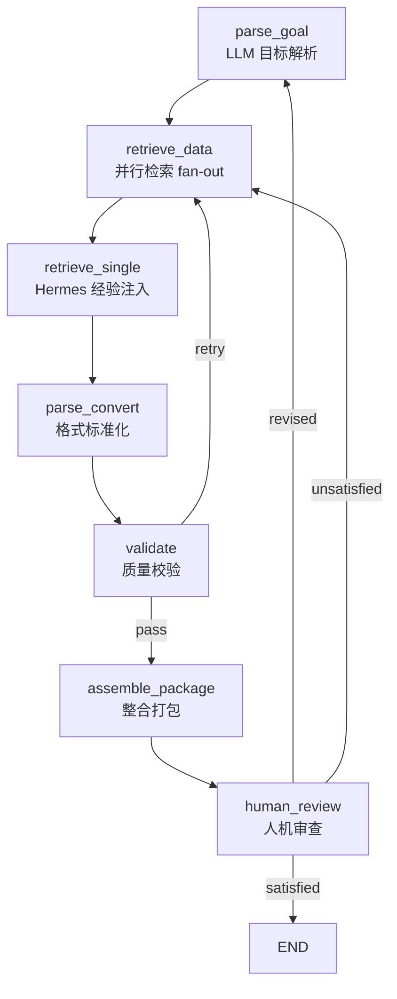

# Robot Data Integrator

> 面向机器人操作与抓取领域的多源异构数据智能整合系统

2026 挑战杯揭榜挂帅 · 阿里云榜题 · 赛道2 维度A

## 概述

Robot Data Integrator (RDI) 是一个基于 LLM 驱动的智能工作流系统，用于从多种异构数据源自动检索、解析、校验和整合机器人操作与抓取研究所需的数据。系统集成 LangGraph 工作流编排、Qwen 大语言模型智能决策、Hermes 持续学习引擎，以及 15 种数据源适配器，最终输出标准化的实验数据包。

## 项目进展

- **第二次联调已完成（2026-08-08）**：系统已能根据中文自然语言目标端到端生成包含 URDF、mesh、MuJoCo MJCF XML 与 grasp JSON 的实验数据包。
- **示例目标**：「我想在 MuJoCo 里用 Franka Panda 机器人抓取 YCB 香蕉，并测试抓取姿态的稳定性。」
- **生成数据包示例**：`data/output_packages/package-20260808-181854/`，包含：
  - `files/req_000.urdf` — Franka Panda URDF
  - `files/req_001.stl` — YCB 香蕉 mesh
  - `files/req_002.xml` — MuJoCo MJCF 场景
  - `files/req_003.json` — grasp 元数据 / synthetic grasp
- **当前测试状态**：393 passed / 1 skipped / 9 deselected。

## 核心特性

- **LLM 驱动的目标解析** — 自动从自然语言目标提取数据需求清单，支持 PDF 论文辅助解析
- **7 节点 LangGraph 工作流** — 目标解析 → 数据检索 → 格式转换 → 质量校验 → 整合打包 → 人机审查
- **15 种数据源适配器** — 覆盖论文、代码、数据集、URDF、网格、抓取、仿真、策略模型、传感器数据
- **Hermes 持续学习引擎** — 基于 ChromaDB 的经验库与策略演化，按成功率动态调整数据源优先级
- **OpenAI 兼容 LLM 接入** — 通过 `LLM_BASE_URL` 一行切换 Qwen / DeepSeek / GLM / OpenAI
- **Gradio 前端** — 支持演示/真实两种运行模式、PDF 上传、数据包可视化审查

## 项目结构

```
src/rdi/
├── config/           # Pydantic Settings 配置
├── models/           # 数据模型（Goal, Manifest, Parsed, Retrieval 等）
├── exceptions.py     # 异常体系（LLMUnavailableError, AdapterError 等）
├── graph/            # LangGraph 工作流编排
│   ├── builder.py    #   图构建（7 节点 + 条件路由）
│   ├── state.py      #   工作流状态定义
│   ├── edges.py      #   条件边路由
│   └── nodes/        #   工作流节点
│       ├── parse_goal.py       # 目标解析（LLM）
│       ├── retrieve_data.py   # 并行数据检索（fan-out）
│       ├── parse_convert.py   # 格式转换与标准化
│       ├── validate.py        # 质量校验
│       ├── assemble.py        # 数据包整合
│       └── human_review.py   # 人机审查
├── intelligence/     # LLM 智能层
│   ├── client.py     #   OpenAI 兼容 LLM 客户端
│   ├── embedding.py   #   Embedding 服务
│   └── prompts/      #   Prompt 模板
├── hermes/           # 持续学习引擎
│   ├── engine.py     #   HermesEngine 统一接口
│   ├── experience_db.py  # ChromaDB 经验库
│   └── strategy.py   #   策略演化器
├── adapters/         # 数据源适配器（15 种）
│   ├── base.py       #   适配器基类
│   ├── registry.py   #   DataReqType → DataSource 映射
│   ├── arxiv.py      #   论文
│   ├── ieee.py       #   IEEE Xplore
│   ├── github.py     #   GitHub 仓库
│   ├── huggingface.py#   HuggingFace 模型/数据集
│   ├── graspnet.py   #   抓取数据集
│   ├── ycb.py        #   YCB 物体集
│   ├── franka.py     #   Franka 机器人
│   ├── allegro.py    #   Allegro 手
│   ├── robotiq.py    #   Robotiq 夹爪
│   ├── mujoco.py     #   MuJoCo 模型
│   ├── isaac.py      #   NVIDIA Isaac Sim
│   └── ...
├── skills/           # 数据处理技能包（7 种）
│   ├── urdf_convert.py   #   URDF 转换与校验
│   ├── mesh_process.py   #   网格处理
│   ├── grasp_parse.py    #   抓取数据解析
│   ├── sim_config.py     #   仿真配置生成
│   ├── policy_interface.py  # 策略/权重接口
│   └── sensor_data.py    #   传感器数据处理
└── frontend/         # Gradio 前端应用
    └── app.py        #   Web UI 入口
```

## 快速开始

### 环境要求

- Python >= 3.11
- [uv](https://docs.astral.sh/uv/) 包管理器

### 安装

```bash
# 克隆仓库
git clone https://github.com/Yezilong11/robot-data-integrator.git
cd robot-data-integrator

# 安装依赖
uv sync

# 复制环境配置
cp .env.example .env
# 编辑 .env 填入真实 API Key
```

### 运行

```bash
# 启动 Gradio 前端
uv run python -m rdi.frontend.app

# 运行第二次联调 demo（生成 URDF + STL + MJCF XML + grasp JSON 数据包）
uv run python scripts/run_second_integration_demo.py

# 运行测试
uv run pytest tests/unit/ -v

# 代码检查
uv run ruff check src/rdi/
uv run mypy src/rdi/
```

## 配置

### LLM 配置

本项目采用 **OpenAI 兼容接口**接入大语言模型，通过 `LLM_BASE_URL` 切换厂商，无需修改代码。

`.env` 中相关配置项：

```env
LLM_API_KEY=sk-xxxx
LLM_BASE_URL=https://dashscope.aliyuncs.com/compatible-mode/v1
LLM_MODEL=qwen-plus
LLM_EMBEDDING_MODEL=text-embedding-v3
LLM_MAX_RETRIES=3
LLM_TEMPERATURE=0.3
```

### 切换 LLM 厂商

只需修改 `LLM_BASE_URL` 和 `LLM_MODEL`（必要时同步改 `LLM_EMBEDDING_MODEL`）：

| 厂商 | `LLM_BASE_URL` | `LLM_MODEL` 示例 |
|------|---------------|------------------|
| 阿里云 Qwen | `https://dashscope.aliyuncs.com/compatible-mode/v1` | `qwen-plus` |
| DeepSeek | `https://api.deepseek.com/v1` | `deepseek-chat` |
| 智谱 GLM | `https://open.bigmodel.cn/api/paas/v4` | `glm-4-plus` |
| OpenAI | `https://api.openai.com/v1` | `gpt-4o-mini` |

> **注意**：原 `QWEN_*` 环境变量已重命名为 `LLM_*` 并新增 `LLM_BASE_URL`。迁移方式：将 `.env` 中 `QWEN_API_KEY` 改为 `LLM_API_KEY`，依此类推。

### 数据源 API Key

部分适配器需要额外配置 API Key：

```env
GITHUB_TOKEN=ghp-...           # GitHub 适配器
IEEE_API_KEY=your-ieee-key      # IEEE Xplore 适配器
HF_ENDPOINT=https://hf-mirror.com  # HuggingFace 镜像（可选）
```

### 适配器与存储

```env
ADAPTER_TIMEOUT=30.0           # 适配器超时（秒）
ADAPTER_MAX_RETRY=3             # 最大重试次数
ADAPTER_RATE_LIMIT=10           # 速率限制（请求/秒）
CACHE_TTL_SECONDS=3600          # 缓存 TTL（秒）
CACHE_MAX_ENTRIES=256           # 内存缓存最大条目数
CHROMADB_PATH=./data/experience_db  # Hermes 经验库路径
OUTPUT_DIR=./data/output_packages  # 输出数据包路径
LOG_LEVEL=INFO                  # 日志级别
LOG_FORMAT=json                 # 日志格式（json/console）
```

## 工作流



## 数据源

系统支持 9 种数据需求类型，映射到 15 种数据源：

| 数据类型 | 数据源 |
|----------|--------|
| 论文 | arXiv, IEEE, Papers with Code |
| 代码 | GitHub, Papers with Code |
| 数据集 | GitHub, HuggingFace, Zenodo, GraspNet |
| 机器人 URDF | Franka, Robotiq, Allegro, GitHub |
| 3D 网格 | YCB, Google Scanned, GitHub |
| 抓取标注 | GraspNet, DexGrasp, YCB |
| 仿真配置 | MuJoCo, Isaac Sim |
| 策略模型 | HuggingFace, GitHub |
| 传感器数据 | GitHub, Zenodo |

## 技术栈

| 层级 | 技术 |
|------|------|
| LLM 接入 | OpenAI SDK（兼容 Qwen / DeepSeek / GLM） |
| 工作流编排 | LangGraph + LangChain Core |
| 向量存储 | ChromaDB（Hermes 经验库） |
| 数据模型 | Pydantic v2 + Pydantic Settings |
| HTTP 客户端 | aiohttp + httpx |
| 机器人数据处理 | trimesh, lxml, numpy, scipy |
| PDF 解析 | PyMuPDF (fitz) |
| 前端 | Gradio |
| 日志 | structlog |
| 包管理 | uv + hatchling |

## 测试

```bash
# 单元测试
uv run pytest tests/unit/ -v

# 带覆盖率
uv run pytest tests/unit/ -v --cov=rdi --cov-report=term-missing

# 排除 integration 测试（默认行为）
uv run pytest tests/ -v -m "not integration"
```

## CI/CD

项目使用 GitHub Actions 进行持续集成：

- **lint** — ruff check + ruff format + mypy（开发期 non-blocking）
- **test** — pytest + coverage 上传至 Codecov
- **build** — Docker 镜像构建（仅 PR 时触发）

## License

[MIT](LICENSE)